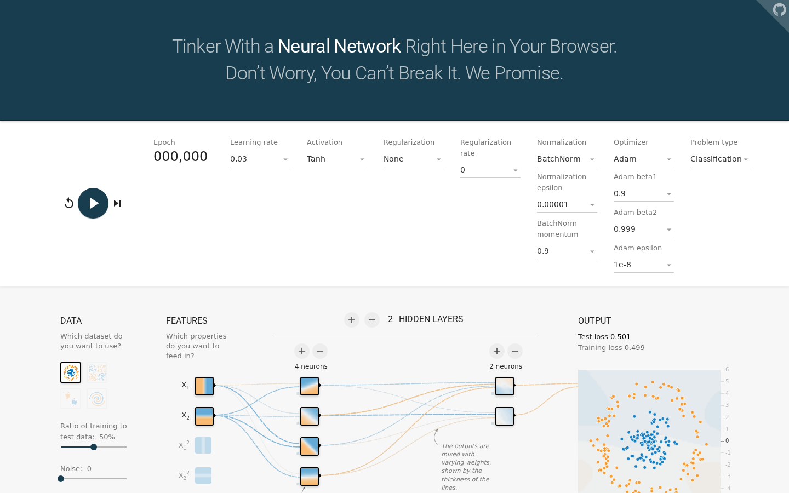

# TF Playground 功能扩展

本仓库基于 [tensorflow/playground](https://github.com/tensorflow/playground)
进行课程作业扩展，并继续整理自
[Lealand23231513/playground](https://github.com/Lealand23231513/playground)。

扩展目标是为原始 TF Playground 增加 normalization 层和新的优化器配置，
并保持浏览器端可视化交互方式不变。

## 已实现功能

- Normalization：
  - BatchNorm
  - LayerNorm
- Optimizer：
  - SGD 原有路径
  - Adam
  - Muon
- UI 配置：
  - 顶部控制栏可选择 normalization 和 optimizer
  - 根据所选算法显示对应超参数
  - batch size、normalization、optimizer 及超参数支持 URL hash 保存
- 训练流程：
  - 使用 mini-batch 入口 `trainBatch()`
  - BatchNorm 按 batch 维度统计
  - LayerNorm 按单样本的层内节点维度统计
  - 输出层不做 normalization
- 测试：
  - 覆盖 SGD/Adam/Muon 与 None/BatchNorm/LayerNorm 的基本训练稳定性
  - 覆盖 BatchNorm 统计维度、LayerNorm 统计维度
  - 覆盖 Adam 状态更新与 Muon 的矩阵权重更新路径

完整设计见 [DESIGN.md](DESIGN.md)。

## 运行截图

下图为本项目在 `BatchNorm + Adam` 配置下的运行界面：



## 运行方式

首次运行请安装依赖：

```bash
npm ci
```

如果当前环境的 npm 版本较旧，无法执行 `npm ci`，可以改用：

```bash
npm install
```

构建静态文件：

```bash
npm run build
```

启动服务：

```bash
npm run serve
```

如果 `npm run serve` 在新版本 Node.js 下遇到 `serve` 包兼容问题，可以使用：

```bash
cd dist
python3 -m http.server 5000
```

然后访问：

```text
http://localhost:5000/
```

## 测试方式

运行神经网络核心逻辑测试：

```bash
npm test
```

该测试不依赖浏览器 DOM，直接转译并执行 `src/nn.ts`。

本次提交已验证：

```text
npm test
npm run build
```

## 核心文件

- `src/nn.ts`：神经网络前向传播、反向传播、normalization 和 optimizer 核心逻辑
- `src/playground.ts`：训练循环、mini-batch 调用、UI 状态与算法参数接线
- `src/state.ts`：URL hash 状态序列化和反序列化
- `index.html`：新增 normalization / optimizer 控件
- `test/nn_smoke_test.js`：核心训练逻辑测试
- `DESIGN.md`：整体设计与实现说明

## 建议验收步骤

1. 执行 `npm ci`
2. 执行 `npm test`
3. 执行 `npm run build`
4. 启动页面后分别选择：
   - `Normalization = BatchNorm`
   - `Normalization = LayerNorm`
   - `Optimizer = Adam`
   - `Optimizer = Muon`
5. 点击运行，观察 loss 曲线和决策边界是否稳定更新

This is not an official Google product.
